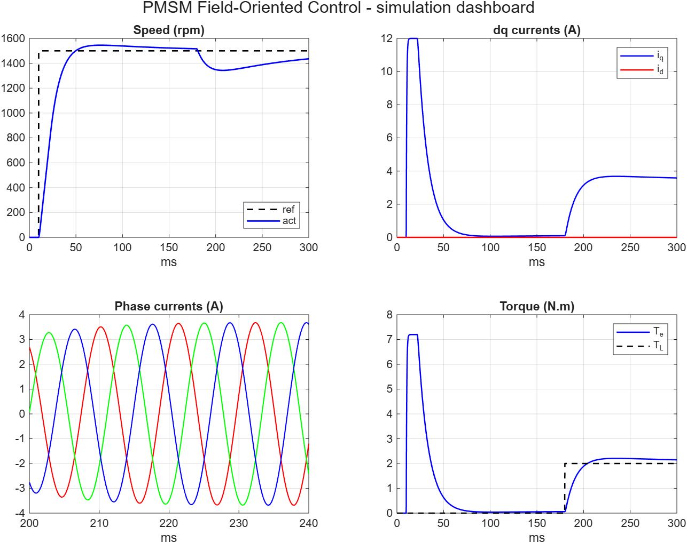
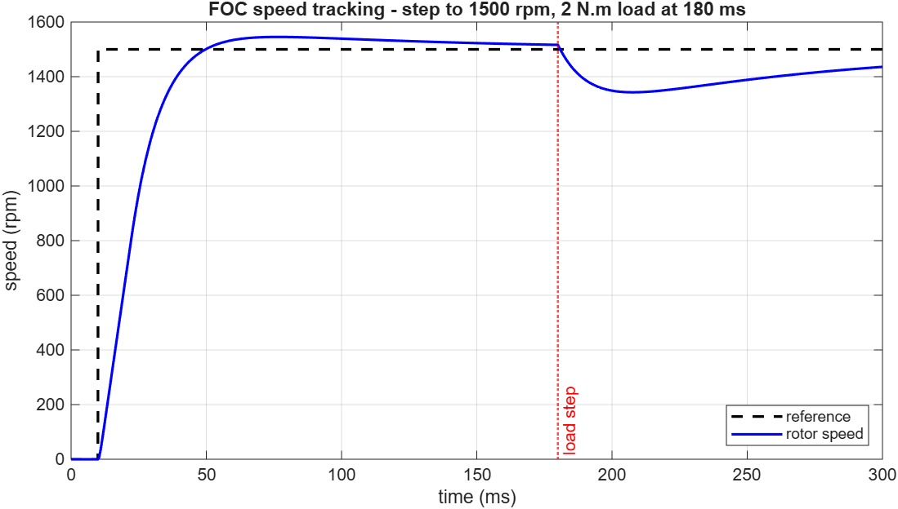
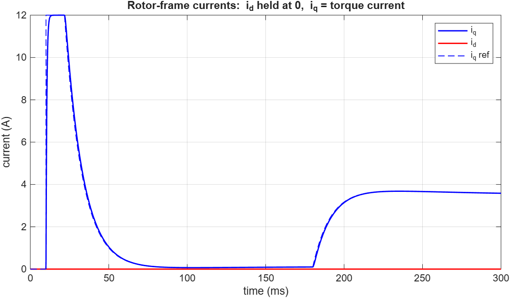
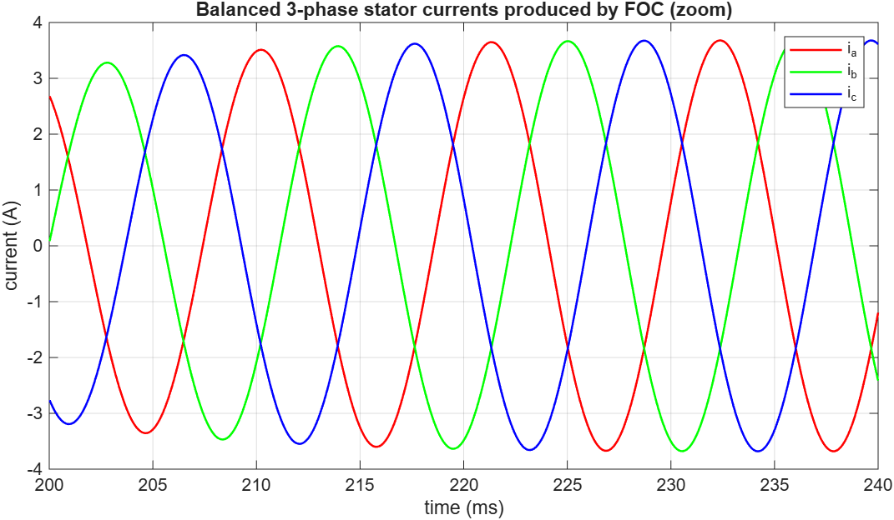
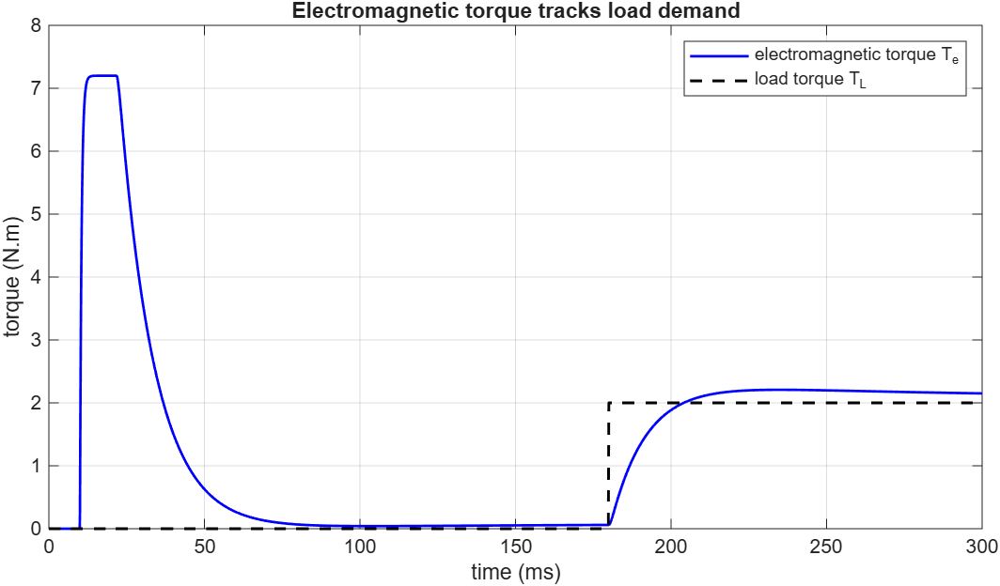

# Project 1 — PMSM Field-Oriented Control (FOC)

A complete **Field-Oriented Control** drive for a Permanent-Magnet Synchronous Motor,
built from the motor's differential equations up in **base MATLAB**. FOC is the control
scheme behind essentially every modern EV traction motor and industrial servo — it makes
an AC motor behave like an easily-controlled DC motor by regulating current in the rotor
(dq) reference frame.

## Control structure (cascaded loops)

```
 speed_ref ─►[ speed PI ]─► iq_ref ─┐
                          id_ref=0 ─┴─►[ current PI ×2 ]─► vd,vq
                                     ─► inverse Park ─► (inverter) ─► PMSM
   measured phase currents ─► Clarke ─► Park(θe) ─► id, iq  (feedback)
```

- **id → 0**  : no flux-weakening, so all stator current produces torque
- **iq → torque** : commanded by the outer speed loop
- **decoupling feedforward** cancels the ω·L cross-coupling between the d and q axes

## Motor & control parameters

| | |
|---|---|
| Rs, Ld=Lq, ψm | 0.5 Ω, 4 mH, 0.10 Wb |
| Pole pairs, J, B | 4, 1×10⁻³ kg·m², 5×10⁻⁴ N·m·s |
| Current-loop bandwidth | 300 Hz |
| Speed-loop bandwidth | 15 Hz |
| Test | step to 1500 rpm, then 2 N·m load at 180 ms |

## Results

### Simulation dashboard


### Speed tracking


Rotor speed reaches 1500 rpm with a **2% settling time of ~35 ms**, and recovers from the
2 N·m load disturbance at 180 ms — the outer speed loop rejecting the torque step.

### dq currents — the essence of FOC


`id` is held at **0** throughout while `iq` carries the torque: it saturates at the 12 A
current limit during acceleration, then settles to the value that balances the 2 N·m load.
This decoupling of flux (d) and torque (q) is exactly what FOC achieves.

### Balanced three-phase currents


The dq control produces clean, balanced 120°-spaced sinusoidal stator currents whose
amplitude equals the torque demand — the physical output of the inverse Park/Clarke chain.

### Torque


Electromagnetic torque `Te = 1.5·P·ψm·iq` tracks the load: a large transient to accelerate
the inertia, then settling to match the applied 2 N·m.

Metrics: [`results/foc_results.txt`](results/foc_results.txt).
